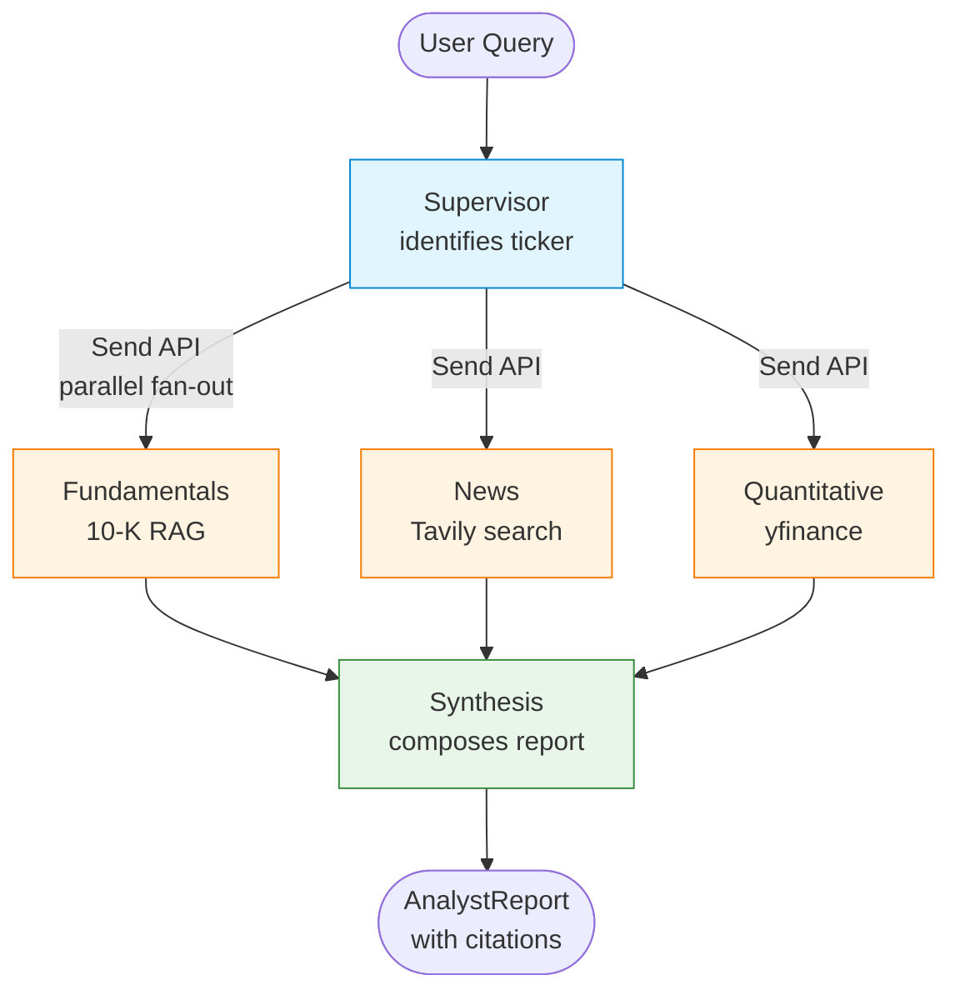

# Multi-Agent Financial Analyst

A LangGraph-based system that produces an analyst report on a public company by coordinating four specialist agents — three running in **parallel** via LangGraph's Send API — and synthesising their structured outputs into a cited report.

Built as a learning project to deeply explore the supervisor pattern, parallel agent dispatch, and structured-output contracts between LLM nodes.

---

## What it does

Given a question like *"Should I be concerned about Tesla's margin trajectory?"*, the system:

1. **Supervisor** identifies the target company and ticker.
2. **Three specialists run concurrently:**
   - **Fundamentals** — RAG over the company's most recent 10-K filing
   - **News** — Tavily web search for recent coverage with sentiment
   - **Quantitative** — yfinance market data, ratios, and peer comparisons
3. **Synthesis** composes a structured analyst report with citations on every claim.

Every inter-agent message is a typed Pydantic model — no free-form strings between nodes.

---

## Architecture



The three specialists are dispatched concurrently and the synthesis node runs once, after all three complete (LangGraph's super-step semantics give us the fan-in barrier for free).

---

## Stack

| Layer | Choice | Why |
|---|---|---|
| Orchestration | LangGraph + LangChain | Native support for parallel dispatch and typed state |
| LLM | Gemini 2.0 Flash (`langchain-google-genai`) | One provider for everything — keeps stack minimal |
| Embeddings | `text-embedding-004` | Same provider as the LLM, free tier friendly |
| Vector store | Chroma (in-process, persistent) | No Docker, no managed service |
| Filings | `sec-edgar-downloader` | Official SEC EDGAR client |
| Market data | `yfinance` | Free, public, no API key |
| Web search | `langchain-tavily` | LLM-optimised search results |
| Structured outputs | Pydantic v2 | Type-checked agent contracts |
| Config | `pydantic-settings` | One settings singleton, env-driven |
| UI | Streamlit | Minimal, fast to ship |
| Packaging | `uv` + `pyproject.toml` | Fast deterministic installs |

No Docker. No observability stack. No eval framework. Five well-known tickers pre-ingested.

---

## Setup

### Prerequisites
- Python 3.11+
- [`uv`](https://docs.astral.sh/uv/) installed
- API keys for **Google AI Studio** (Gemini) and **Tavily** (both have free tiers)

### Install

```bash
git clone <repo>
cd financial-analyst

# Install dependencies into a managed venv
uv sync

# Configure API keys
cp .env.example .env
# then edit .env and paste your GOOGLE_API_KEY and TAVILY_API_KEY
```

### Ingest 10-K filings (one-time, ~10 min)

```bash
uv run python -m data.ingest
```

This downloads the latest 10-K for AAPL, MSFT, GOOGL, TSLA, NVDA, chunks each filing, embeds the chunks with `text-embedding-004`, and stores them in `chroma_db/`. Idempotent — safe to re-run.

### Run the app

```bash
uv run streamlit run app.py
```

Open `http://localhost:8501`.

---

## Sample run

Query: *"Should I be concerned about Tesla's margin trajectory?"*

```
✅ Supervisor — identifying company           (0.4s)
✅ Quantitative — fetching market data        (3.1s)   ┐
✅ News — scanning recent coverage            (5.2s)   ├─ run in parallel
✅ Fundamentals — analysing 10-K filings     (6.8s)   ┘
✅ Synthesis — composing report               (4.1s)

Total: ~11s wall-clock (vs. ~19s sequential)
```

The output is an `AnalystReport` containing an executive summary, a balanced bull/bear thesis, sections for Fundamentals / News / Quantitative / Risks (each with citations), a key-risks list, and an unmissable not-investment-advice disclaimer.

---

## Design decisions

### Why a supervisor pattern?

A supervisor decouples *what to do* (the query) from *who does it* (the specialists). Adding a new specialist is one new node + one line in the dispatch list — no other agents need to know. The supervisor also handles input validation (ticker identification, supported-set check) so specialists can assume their inputs are clean.

### Why the Send API for fan-out?

LangGraph offers two ways to fan out work:

| Approach | What it gives you | What it costs |
|---|---|---|
| Static edges (one source, N targets) | Parallel execution | Targets fixed at compile time |
| `Send` via conditional edge | Parallel execution + **runtime choice of targets + custom payload per branch** | One extra function in `graph.py` |

For this project the targets are always the same three specialists, so static edges would behave identically *today*. We chose `Send` because:
1. It's the idiomatic supervisor pattern in LangGraph.
2. The `dispatch_specialists()` function is the natural extension point for "skip News if the question is purely historical" or "spawn two Fundamentals branches for different sub-queries".
3. Understanding how the runtime turns a list of `Send` objects into a concurrent execution schedule is the main thing I wanted to learn.

See [`src/graph.py`](src/graph.py) for the heavily-commented topology.

### Why structured outputs everywhere?

Every agent uses `llm.with_structured_output(SomeModel)`. The LLM is forced to emit JSON that conforms to a Pydantic v2 schema. Benefits:
- **No parsing layer** between agents — `AgentState` carries typed objects, not strings.
- **Schema-level constraints** prevent classes of errors (e.g. sentiment can only be `'positive' | 'negative' | 'neutral'`).
- **Validation happens at the LLM call boundary** — invalid outputs are retried by the SDK before reaching application code.

### Why parallel state writes don't conflict

When three branches run concurrently, LangGraph merges their state updates using *reducers* defined on the state schema. Our specialists each write to a **different** state key (`fundamentals_analysis`, `news_analysis`, `quantitative_analysis`), so there's no overwrite conflict. They all append to `messages`, which uses the `add_messages` reducer — safe under concurrent writes.

If two parallel branches tried to write the same non-message key without a reducer, LangGraph would raise `InvalidUpdateError`. That constraint is what drove the per-specialist state-key design.

### Why graceful per-agent failure

A `yfinance` blip shouldn't kill the report. Every specialist returns a `data_available=False` analysis on failure rather than raising. Synthesis is explicitly instructed to acknowledge missing data in the corresponding section rather than fabricate substitutes. The user always gets *some* report, with clear signposting of what's missing.

### Why citations are first-class

`Citation` is a shared Pydantic primitive used by all three specialists and threaded through into `AnalystReport.sections`. Every material claim in the final report is backed by a `Citation` with source type, label, optional URL, and optional excerpt. The Streamlit UI renders these as clickable references under each section.

---

## Project structure

```
financial-analyst/
├── data/
│   └── ingest.py            # One-shot SEC download + chunk + embed
├── src/
│   ├── config.py            # pydantic-settings singleton
│   ├── llm.py               # get_llm() factory
│   ├── state.py             # LangGraph state schema
│   ├── models.py            # All Pydantic v2 output schemas
│   ├── graph.py             # Topology + Send API dispatch
│   ├── agents/
│   │   ├── supervisor.py
│   │   ├── fundamentals.py
│   │   ├── news.py
│   │   ├── quantitative.py
│   │   └── synthesis.py
│   └── tools/
│       ├── rag.py           # Chroma retriever wrapper
│       ├── web_search.py    # Tavily wrapper
│       └── market_data.py   # yfinance wrapper
├── app.py                   # Streamlit UI
├── pyproject.toml
└── .env.example
```

---

## Roadmap

Things deliberately scoped out for v1:

- Section-level 10-K extraction (currently chunks are tagged generically as `filing`; Items 1 / 1A / 7 would improve citation granularity).
- Multi-year filing support (currently latest 10-K only).
- LangSmith tracing.
- Eval harness with held-out questions and rubric-graded outputs.
- Dynamic specialist routing (the `dispatch_specialists()` extension point).

---

## Disclaimer

This system is built as a learning project. Its output is generated by AI and does **not** constitute investment advice, a recommendation to buy or sell any security, or a solicitation of any kind. Always consult a licensed financial advisor before making investment decisions.
# Multi-Agent-Financial-Analyst

# Multi-Agent-Financial-Analyst

# Multi-Agent-Financial-Analyst

